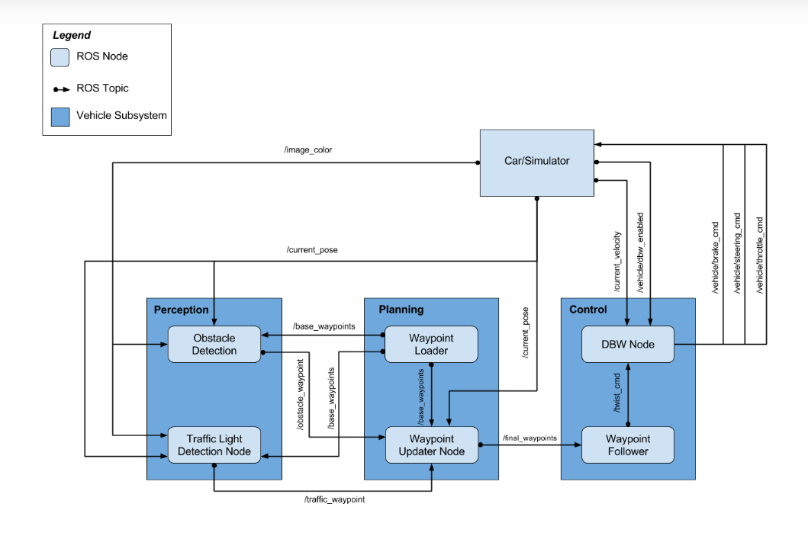

# Programming a Real Self-Driving Car
[](http://www.udacity.com/drive)

This is the project repo for the final project of the Udacity Self-Driving Car Nanodegree: Programming a Real Self-Driving Car. For more information about the project, see the project introduction [here](https://classroom.udacity.com/nanodegrees/nd013/parts/6047fe34-d93c-4f50-8336-b70ef10cb4b2/modules/e1a23b06-329a-4684-a717-ad476f0d8dff/lessons/462c933d-9f24-42d3-8bdc-a08a5fc866e4/concepts/5ab4b122-83e6-436d-850f-9f4d26627fd9).

### Team Member

| Team Members                | eMail Address                           |
| :-------------------------- | --------------------------------------- |
| Andrew Friedman (Team Lead) | andrew at cyberdreaming dot net         |
| Christian Röpke             | chroepke at gmail dot com               |
| Angelo Antonio Manzatto     | angelo.manzatto at yahoo dot com dot br |
| Lily Huang                  | lilyhappily at 126 dot com              |
| Sarath Radhakrishnan        | sarath.rk at outlook dot com            |

### System Architecture Diagram

For this project, you'll be writing ROS nodes to implement core functionality of the autonomous vehicle system, including traffic light detection, control, and waypoint following! You will test your code using a simulator, and when you are ready, your group can submit the project to be run on Carla.

The following is a system architecture diagram showing the ROS nodes and topics used in the project. You can refer to the diagram throughout the project as needed. The ROS nodes and topics shown in the diagram are described briefly in the **Code Structure** section below, and more detail is provided for each node in later classroom concepts of this lesson.



### The Results Visualizer

<table style="width:100%">
  <tr>
    <th>
      <p align="center">
       
      </p>
    </th>
    <th>
      <p align="center">
       
      </p>
    </th>
  </tr>
  </table>

### Traffic Lights Classifier on Test Site

If you want to get a good result, using [ROS `bags`](http://wiki.ros.org/Bags) that were recorded at the test site: [Traffic Light Detection Test Video](https://drive.google.com/file/d/0B2_h37bMVw3iYkdJTlRSUlJIamM/view?usp=sharing). The images are used to train traffic lights classifier based on the [**TensorFlow Object Detection API**](https://github.com/tensorflow/models/tree/master/research/object_detection). You will find the details on [my github repository](https://github.com/lilyhappily/CarND-Capstone-Traffic-Lights-Detection.git)

# VM or Native **or** Docker Installation 

### Project Setup

The project will require the use of Ubuntu Linux (the operating system of Carla) and a new simulator. To reduce installation difficulties, we have provided an in-browser Workspace for you to work with. You can find instructions for the Workspace and the Workspace itself later in this lesson.

If you prefer not to use the Workspace, follow the steps below to get set up:

- Because ROS is used, you will need to use Ubuntu to develop and test your project code. You may use

  - Ubuntu 14.04 with ROS Indigo
  - Ubuntu 16.04 with ROS Kinetic

  You are welcome to use your own Ubuntu installation or virtual machine (unsupported), or you can use the VM provided in *Your Virtual Machine* in the "Introduction to ROS" lesson. The provided VM has ROS and Dataspeed DBW installed already.

- *Windows 10 users* - your fellow students have suggested that the best local option is to use the VM for ROS, while running the simulator natively (and making sure to open ports between the two for communication).

- The project repo can be found [here](https://github.com/udacity/CarND-Capstone). Clone or download the project code before the next sections so you can follow along with the code descriptions! In the README, you should be able find any additional dependencies needed for the project.

- The system integration project uses its own simulator which will interface with your ROS code and has traffic light detection. You can download the simulator [here](https://github.com/udacity/CarND-Capstone/releases). To improve performance while using a VM, we recommend downloading the simulator for your host operating system and using this outside of the VM. You will be able to run project code within the VM while running the simulator natively in the host using port forwarding on port `4567`. For more information on how to set up port forwarding, see the end of the classroom concept [here](https://s3-us-west-1.amazonaws.com/udacity-selfdrivingcar/files/Port+Forwarding.pdf).

### VM Installation from Udacity

The VM is a rather large download (4+GB!). So, find yourself a good internet connection and download the [compressed VM disk image](https://s3-us-west-1.amazonaws.com/udacity-selfdrivingcar/Udacity_VM_Base_V1.0.0.zip).Once you are up and running, you might be asked to input a password to enter the VM. **The password for the VM is udacity-nd**

We recommend using [VirtualBox](https://www.virtualbox.org/wiki/Downloads) to run the VM. This will enable you to easily use port forwarding, so you can run the final project simulator in your native operating system (the host) while using the VM for running ROS code.

Whichever operating system you're on, download and install the appropriate platform package for your operating system (the host) and then follow the instructions below:

#### Import your VM image to VirtualBox

1. Download and install VirtualBox.
2. Download the image from supplied link.
3. Unzip the image.
4. Open VirtualBox Application.
5. Click File > Import Appliance..
6. Click the folder icon on the right and navigate to your unzipped image (the **.ovf** file).
7. Follow the prompts to import the image.
8. From the VirtualBox Manager, select your VM and press start.

### Native Installation

* Be sure that your workstation is running Ubuntu 16.04 Xenial Xerus or Ubuntu 14.04 Trusty Tahir. [Ubuntu downloads can be found here](https://www.ubuntu.com/download/desktop).
* If using a Virtual Machine to install Ubuntu, use the following configuration as minimum:
  * 2 CPU
  * 2 GB system memory
  * 25 GB of free hard drive space

  The Udacity provided virtual machine has ROS and Dataspeed DBW already installed, so you can skip the next two steps if you are using this.

* Follow these instructions to install ROS
  * [ROS Kinetic](http://wiki.ros.org/kinetic/Installation/Ubuntu) if you have Ubuntu 16.04.
  * [ROS Indigo](http://wiki.ros.org/indigo/Installation/Ubuntu) if you have Ubuntu 14.04.
* [Dataspeed DBW](https://bitbucket.org/DataspeedInc/dbw_mkz_ros)

  * Use this option to install the SDK on a workstation that already has ROS installed: [One Line SDK Install (binary)](https://bitbucket.org/DataspeedInc/dbw_mkz_ros/src/81e63fcc335d7b64139d7482017d6a97b405e250/ROS_SETUP.md?fileviewer=file-view-default)
* Download the [Udacity Simulator](https://github.com/udacity/CarND-Capstone/releases).

### Docker Installation
[Install Docker](https://docs.docker.com/engine/installation/)

Build the docker container
```bash
docker build . -t capstone
```

Run the docker file
```bash
docker run -p 4567:4567 -v $PWD:/capstone -v /tmp/log:/root/.ros/ --rm -it capstone
```

### Port Forwarding
To set up port forwarding, please refer to the [instructions from term 2](https://classroom.udacity.com/nanodegrees/nd013/parts/40f38239-66b6-46ec-ae68-03afd8a601c8/modules/0949fca6-b379-42af-a919-ee50aa304e6a/lessons/f758c44c-5e40-4e01-93b5-1a82aa4e044f/concepts/16cf4a78-4fc7-49e1-8621-3450ca938b77)

### Usage

1. Clone the project repository
```bash
git clone https://github.com/udacity/CarND-Capstone.git
```

2. Install python dependencies
```bash
cd CarND-Capstone
pip install -r requirements.txt
```
3. Make and run styx
```bash
cd ros
catkin_make
source devel/setup.sh
roslaunch launch/styx.launch
```
4. Run the simulator

### Real world testing
1. Download [training bag](https://s3-us-west-1.amazonaws.com/udacity-selfdrivingcar/traffic_light_bag_file.zip) that was recorded on the Udacity self-driving car.
2. Unzip the file
```bash
unzip traffic_light_bag_file.zip
```
3. Play the bag file
```bash
rosbag play -l traffic_light_bag_file/traffic_light_training.bag
```
4. Launch your project in site mode
```bash
cd CarND-Capstone/ros
roslaunch launch/site.launch
```
5. Confirm that traffic light detection works on real life images

### Other library/driver information
Outside of `requirements.txt`, here is information on other driver/library versions used in the simulator and Carla:

Specific to these libraries, the simulator grader and Carla use the following:

|        | Simulator | Carla  |
| :-----------: |:-------------:| :-----:|
| Nvidia driver | 384.130 | 384.130 |
| CUDA | 8.0.61 | 8.0.61 |
| cuDNN | 6.0.21 | 6.0.21 |
| TensorRT | N/A | N/A |
| OpenCV | 3.2.0-dev | 2.4.8 |
| OpenMP | N/A | N/A |

We are working on a fix to line up the OpenCV versions between the two.
